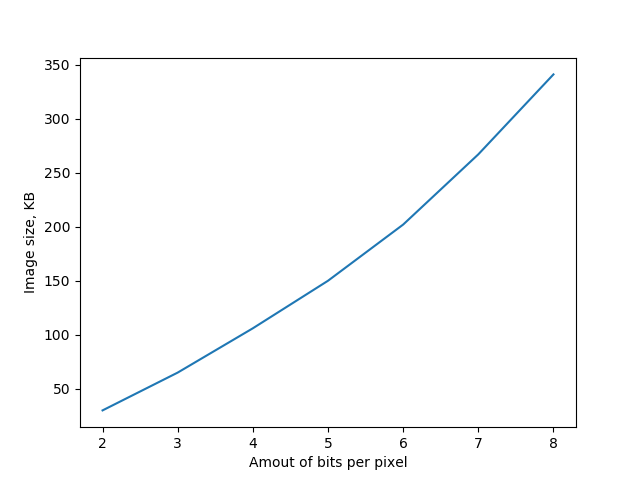

#Однородное квантование

## Анализ вычислительной сложности

Рассмотрим алгоритм, описанный в Википедии[[1]](https://ru.wikipedia.org/wiki/Квантование_(обработка_сигналов)):

> Однородное (линейное) квантование — разбиение диапазона значений на отрезки равной длины. Его можно представлять как деление исходного значения на постоянную величину (шаг квантования) и взятие целой части от частного.

Для каждого из `W*H` пикселей в 3-х каналах требуется по 3 деления. 
и 3 умножения(для нормировки диапазона), итого получается `W*H*3` умножений и делений. Так как операции деления и умножения достаточно затратные, удобно использовать степени двойки в качестве делителя, тогда операции деления и умножения можно заменить простой операцией битового сдвига, всего их потребуется `W*H*6`.

Т.е. алгоритм будет уменьшать количество бит, выделяемое на пиксель.

## Тесты для верификации алгоритма

Для верификации алгоритма предполагается использование нескольких видов тестирования:

- Визуальное
-- Сравнение изображений с разным количеством бит на пиксель

- Аналитическое
-- Зависимость размера от колиества выделяемых бит на пиксель 

## Подготовка данных

На данном этапе важна разработка алгоритма, без учёта организации ввода и вывода архитектуры MIPS, поэтому  для обработки данных в языке C, необходимо получить их в удобном виде.

Для этого было решено разработать программу на Python, которая преобразует изображение в исходный код на языке C. В полученном коде содержатся каналы RGB в виде двумерных массивов типа unsigned char.

## Реализация алгоритма на C

Ниже представлен код наивной реализации алгоритма, которая была описана ранее. Используем его в качестве эталона при тестировании.
	
	double coef = 4.1; 
    for(int i = 0; i < SIZE_H; ++i){
		for(int j = 0; j < SIZE_W; ++j){
			red[i][j] = (int)(((int)(red[i][j] / coef)) * coef);
			green[i][j] = (int)(((int)(red[i][j] / coef)) * coef);
			blue[i][j] = (int)(((int)(red[i][j] / coef)) * coef);
		}
	}

Рассмотрим алгоритм, использующий только целочисленную арифметику. Его недостатком является возможность использования только степеней двойки, но его скорость работы должна быть знаительно выше.
	
	int crop_bits = 2; 
    for(int i = 0; i < SIZE_H; ++i){
        for(int j = 0; j < SIZE_W; ++j){
            red[i][j] = (red[i][j] >> crop_bits) << crop_bits;
            green[i][j] = (green[i][j] >> crop_bits) << crop_bits;
            blue[i][j] = (blue[i][j] >> crop_bits) << crop_bits;
        }
    }

## Промежуточное тестирование

Проведём целочисленного аналога. 

### Визуальный тест

|Количество бит на пиксель|Целочисленный алгоритм            |
|------------------------:|:--------------------------------:|
|8                        |                    |
|7                        |                    |
|6                        |                    |
|5                        |                    |
|4                        |                    |
|3                        |                    |
|2                        |                    |
|1                        |                    |

### Аналитический тест

Аналитический тест заключался в исследовании зависимости размера изображения от количества бит выделяемых на пиксель.

Ниже представлен график полуенной зависимости.
 

### Выводы

Визуальный и аналитический тесты можно считать пройденными, цветавая палитра и размер изображения уменьшаются, как и ожидалось. Единственным недостатком является необходимость использования степеней двойки.

## Рекомендации для программной реализации на MIPS c расширением MSA

В дальнейших разработках предполагается использование "векторизации" и парадигмы SIMD для ускорения обработки данных. Ключевым моментом будет являться длина вектора, которая способна обрабатываться за один такт. 

Для повышения производительности можно попробовать использовать один цикл, вместо двух вложенных, это гарантированно позволит избавиться от `min(W, H)` операций условного перехода. ~~Оптимальным в данном случае является использование обычного доступа через вложенные циклы. [[4]](http://nadeausoftware.com/articles/2012/06/c_c_tip_how_loop_through_multi_dimensional_arrays_quickly)~~ 

В качестве альтернативы развёртке цикла, можно использовать "вертикальный" обход. Это обеспечит оптимальное использование кэша процессора при обработке пикселей. [[5]](https://habrahabr.ru/post/326900/)

## Модель реализации алгоритма для архитектуры MIPS

Реализация алгоритма для архитектуры MIPS без использования SIMD парадигмы не отличается от реализации на языке C. Для компиляции используем следующую команду терминала:
	
	mips-mti-linux-gnu-gcc algo.c -static -mmsa algo 

И для запуска в QEMU:

	qemu-mips -cpu P5600 algo

Очевидно, что в такой реализации остутствуют вызовы MSA команд, поэтому файл `DEBUG.txt` не содержит полезной информации.

## Использование SIMD парадигмы для оптимизации алгоритма

Поскольку мы уменьшаем количество бит, то можно не бояться переполнения и брать сразу по 16 пикселей в один вектор.

	v16u8 *pR = (v16u8*)(&red[0]);
	v16u8 *pG = (v16u8*)(&green[0]);
	v16u8 *pB = (v16u8*)(&blue[0]);

    int crop_bits = 2;
	v16u8 *pMax = pR + (SIZE_W * SIZE_H / 16); 
	for(;pR <= pMax; ++pR, ++pG, ++pB){
		newR = (*(pR) << crop_bits) >> crop_bits; 
        newG = (*(pG) << crop_bits) >> crop_bits;
        newB = (*(pB) << crop_bits) >> crop_bits;
	}

## Результат 

Ниже приведён код реализации финального алгоритма в виде функции.

    void msaVersion(byte** red, byte** green, byte** blue, int crop_bits){
            v16u8 *pR = (v16u8*)(&red[0]);
            v16u8 *pG = (v16u8*)(&green[0]);
            v16u8 *pB = (v16u8*)(&blue[0]);
            
            v16u8 newR, newG, newB;

            v16u8 *pMax = pR + (SIZE_W * SIZE_H / 16); 
            for(;pR <= pMax; ++pR, ++pG, ++pB){
                newR = (*(pR) << crop_bits) >> crop_bits; 
                newG = (*(pG) << crop_bits) >> crop_bits;
                newB = (*(pB) << crop_bits) >> crop_bits;
            }
    }

