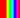
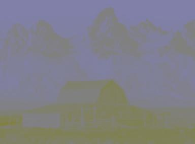
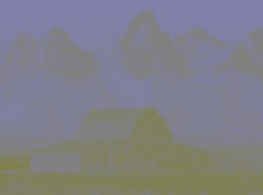
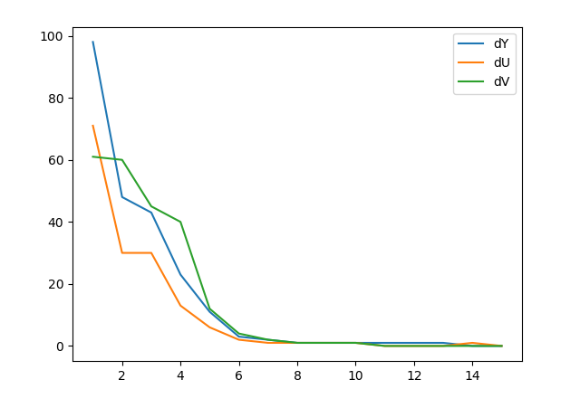
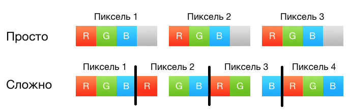
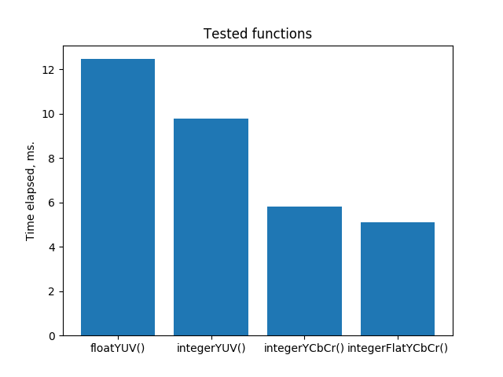

#Преобрaзование цветовых пространств(RGB-YUV)  

## Анализ вычислительной сложности

Рассмотрим алгоритм, описанный в Википедии[[1]](https://ru.wikipedia.org/wiki/YUV):

> Y = 0.299 * R + 0.587 * G + 0.114 * B; 
> U = -0.14713 * R - 0.28886 * G + 0.436 * B + 128; 
> V = 0.615 * R - 0.51499 * G - 0.10001 * B + 128

Для преобразования каждого из `W*H` пикселей в 3 канала требуется по 3 умножения 
и 3 сложения, итого получается `W*H*9` умножений и сложений. При использовании целочисленной арифметики дополнительно потребуется `W*H*9` битовых сдвигов. 

Рассмотрим альтернативу:
> "Когда речь идет о видео или сигналах в цифровой форме, термин «YUV» в основном означает «Y’CbCr»." 

В цветовом пространстве Y'CbCr: 
> "цветовые компоненты по существу определяются в виде разностей между светимостью Y и компонентами R, G и B" [[2]](http://sernam.ru/cod_7.php)

Таким образом, можно существенно сократить количество операций. Для канала яркости всё ещё будет требоваться по 3 операции, но для цветовых каналов будет использоваться одно умножение и одно сложение. В итоге получаем `W*H*5` сложений и умножений

## Тесты для верификации алгоритма

Для верификации алгоритма предполагается использование нескольких видов тестирования:

- Визуальное
-- Сравнение каналов с эталонным преобразованием
-- Сравнение YUV (Результат) и RGB (Оригинал)

- Аналитическое
-- Скорость работы алгоритма
-- Точность работы алгоритма

## Подготовка данных

На данном этапе важна разработка алгоритма, без учёта организации ввода и вывода архитектуры MIPS, поэтому  для обработки данных в языке C, необходимо получить их в удобном виде.

Для этого было решено разработать программу на Python, которая преобразует изображение в исходный код на языке C. В полученном коде содержатся каналы RGB в виде двумерных массивов типа unsigned char.

Рассмотрим пример. Преобразуем исходное изображение в удобное для дальнейшей работы представление.

**Исходное изображение**
В качестве исходного изображения выбрана картинка с градиентной заливкой, размером 20 на 18 пикселей: .

**Пример полученного кода**
Для краткости фрагмента, в массивах red, green и blue присутствует только первая строка из 18.

	//Array implementation of image imgs\test.jpg generated with Python 
	#define SIZE_W 20 
	#define SIZE_H 18;
    
	typedef unsigned char byte; 
    
	int main(){ 
		byte red[SIZE_H][SIZE_W] = {{248,249,253,254,255,237,253,252,168,71,14,0,8,2,0,50,192,238,251,252}, ...}; 
		byte green[SIZE_H][SIZE_W] = {{2,5,1,0,0,14,115,233,255,247,245,255,251,166,37,0,0,15,5,0}, ...}; 
		byte blue[SIZE_H][SIZE_W] = {{5,0,0,10,13,0,0,19,6,1,45,132,229,255,238,255,255,217,106,27}, ...}; 
		return 0; 
	}

## Реализация алгоритма на C

Ниже представлен код наивной реализации алгоритма, которая была описана ранее. Используем его в качестве эталона при тестировании.
	
	for(int i = 0; i < SIZE_H; ++i){
		for(int j = 0; j < SIZE_W; ++j){
			byte R, G, B, Y, U, V;
			
			R = red[i][j];
			G = green[i][j];
			B = blue[i][j];
            
			Y = 0.299 * R + 0.587 * G + 0.114 * B;
			Cb = 128 + 0.564 * (B - Y);
			Cr = 128 + 0.713 * (R - Y);
            
			//Do smth with YCbCr
		}
	}

Рассмотрим алгоритм, использующий только целочисленную арифметику. Для того, чтобы избавиться от дробных коэффициентов, предварительно умножим их на `2^n` и отбросим дробную часть, а в коде используем битовый сдвиг на `n` для деления на `2^n`, причём, чем больше n, тем меньше будет погрешность. Для конкретнности, пусть `n = 16`, тогда алгоритм примет следующий вид.
	
	for(int i = 0; i < SIZE_H; ++i){
		for(int j = 0; j < SIZE_W; ++j){
			byte R, G, B, Y, U, V;
            
			R = red[i][j];
			G = green[i][j];
			B = blue[i][j];
            
			Y = (19595 * R + 38469 * G + 7471 * B) >> 16;
			Cb = 128 + ((36962 * (B - Y)) >> 16);
			Cr = 128 + ((46727 * (R - Y)) >> 16);
            
			//Do smth with YCbCr
		}
	}

## Промежуточное тестирование

Проведём сравнение эталонного алгоритма и его целочисленного аналога. 

### Визуальный тест

|Описание                 |Эталонный алгоритм                |Тестируемый алгоритм            |
|------------------------:|:--------------------------------:|:-------------------------------|
|Исходное изображение RGB:|        |      |
|Канал яркости Y:         |    |  |
|Цветовой канал U:        |    |  |
|Цветовой канал V:        |    |  |
|Объединение каналов YUV: |  ||

### Аналитический тест

Аналитический тест заключался в исследовании отклонения от эталонного алгоритма.

	dY = max(abs(Y1 - Y2), dY)
	dU = max(abs(U1 - U2), dU)
	dV = max(abs(V1 - V2), dV)

Ниже представлен график зависимости максимального отклонения (в пикселях) от `n` на тестовом изображении.
 

Очевидно, что выбранное значение `n = 16` подходит для дальнейшей реализации. Максимальное отклонение по каждому из каналов равно единице, что стоставляет `1/256 = 0.0039 %`.

Из графика видно, что при `n >= 8` отклонение от эталона близко к нулю, поэтому такие значения `n` также можно использовать в целочисленной реализации для уменьшения объёма выделяемой памяти.

### Выводы

Визуальный и аналитический тесты можно считать пройденными, сгенерированные каналы соответствуют эталонным, отклонение составляет менее одного процента. Единственным недостатком является то, что при склейке без использования обратного преобразования теряется яркость, что можно исправить путём увеличения значений в канале яркости. 

## Рекомендации для программной реализации на MIPS c расширением MSA

В дальнейших разработках предполагается использование "векторизации" и парадигмы SIMD для ускорения обработки данных. Ключевым моментом будет являться длина вектора, которая способна обрабатываться за один такт. 

Для повышения производительности можно попробовать использовать один цикл, вместо двух вложенных, это гарантированно позволит избавиться от `min(W, H)` операций условного перехода. ~~Оптимальным в данном случае является использование обычного доступа через вложенные циклы. [[4]](http://nadeausoftware.com/articles/2012/06/c_c_tip_how_loop_through_multi_dimensional_arrays_quickly)~~ 

В качестве альтернативы развёртке цикла, можно использовать "вертикальный" обход. Это обеспечит оптимальное использование кэша процессора при обработке пикселей. [[5]](https://habrahabr.ru/post/326900/)

Как сказано выше, векторизация по оси `Y` нежелательна, так как препятствует оптимальному использованию кэша процессора. Векторизация по оси `X` предположительно является лучшим решением, но она сложна в реализации.

Первая версия векторизации будет производится по оси `Z`. ~~Возможно, что использование наивного алгоритма преобразования в `YUV` будет эффективнее, так как позволит векторизовать все три канала из-за однотипных действий в них.~~ (Предположительно, что нет, так как сами действия окажутся сложнее, чем в алгоритме `YCbCr`).

При последующих тестах проихводительности MIPS модели **необходимо** вернуть настройки QEMU в исходные, так как логирование инструкций с отключённым кэшированием существенно понижает производительность.

~~Возможно имеет смысл избавиться от повторного вычисления значений для каналов U и V путём введения кэширования ранее найденных значений.~~ Алгоритм без использования кэширования каналов работает быстрее.

## Тест скорости
Для проверки некоторых гипотез из предыдущего пункта было проведено тестирование скорости всех предполагаемых алгоритмов. Каждый из них был запущен `100000` раз и в качестве времени выполнения было взято среднее значение. Тестирование проводилость на изображении размером `20 * 18` пикселей. Оптимизация комилятора отключена. Полученный результат приведён ниже:

	floatYCbCr() took 11.06 microseconds.
	integerHorizontalYCbCr() took 5.8 microseconds.
	integerVerticalYCbCr() took 6.28 microseconds.
	cachedIntegerVerticalYCbCr() took 6.3mics.
	integerFlatYCbCr() took 5.1 microseconds.

Дополнительно было проведено сравнение `YUV` и `YCbCr`:

### Выводы
Результаты, полученые в ходе тестирования соответствуют результатам, полученным в статьях [4] и [5], а также подтверждают пользу использования `YCbCr` вместо `YUV`. Оптимальным решением на данном этапе является использование целочисленной арифметики и одного "плоского"
цикла. Уже сейчас удалось достигнуть улучшения производительности более чем в `2` раза. 

Ниже приведён код для integerFlatYCbCr():

	for(unsigned long cnt = 0; cnt < SIZE_H * SIZE_W; ++cnt){
		byte R, G, B, Y, U, V;
		
		R = *(red[0] + cnt);
		G = *(green[0] + cnt);
		B = *(blue[0] + cnt);
	
		Y = (19595 * R + 38469 * G + 7471 * B) >> 16;
		U = 128 + ((36962 * (B - Y)) >> 16);
		V = 128 + ((46727 * (R - Y)) >> 16);

		//Do smth with YCbCr
	}

Использование такого обхода позволит значительно упростить векторизацию по оси `X`, являющуюся самой оптимальной, но **необходимым условем является последовательное хранение данных в памяти**!

## Модель реализации алгоритма для архитектуры MIPS

Реализация алгоритма для архитектуры MIPS без использования SIMD парадигмы не отличается от реализации на языке C. Для компиляции используем следующую команду терминала:
	
	mips-mti-linux-gnu-gcc algo.c -static -mmsa algo 

И для запуска в QEMU:

	qemu-mips -cpu P5600 algo

Очевидно, что в такой реализации остутствуют вызовы MSA команд, поэтому файл `DEBUG.txt` не содержит полезной информации.

## Использование SIMD парадигмы для оптимизации алгоритма

Ниже приведена реализация алгоритма преобразования в YCbCr с векторизацией по оси `Z`:

	byte R, G, B, Y, U, V;
	
	v4i32 MUL_Y = {19595, 38469, 7471, 0};
	v4i32 MUL_UV = {46727, 1, 36962, 0};		
	v4i32 SHIFT = {16, 16, 16, 0};

	for(unsigned long cnt = 0; cnt < SIZE_H * SIZE_W; ++cnt){
		R = *(red[0] + cnt);
		G = *(green[0] + cnt);
		B = *(blue[0] + cnt);

		v4i32 RGB = {R, G, B, 0};

		RGB = __builtin_msa_mulv_w(RGB, MUL_Y);
		RGB = __builtin_msa_sra_w(RGB, SHIFT);

		Y = RGB[0] + RGB[1] + RGB[2];
		RGB[0] = R; RGB[2] = B;

		v4i32 temp = {Y, 0, Y, 0};
		temp = __builtin_msa_subs_s_w(RGB, temp);
		temp = __builtin_msa_mulv_w(temp, MUL_UV);
		temp = __builtin_msa_sra_w(temp, SHIFT);
		
		U = 128 + temp[2];
		V = 128 + temp[0];
	}

Также удалось использовать векторизацию по оси `X`:
Важно отметить, что к изображению относятся только первые (SIZE_W*SIZE_H) пикселей, а остальные должны быть отброшены.

	v16u8 *pR = (v16u8*)(&red[0]);
	v16u8 *pG = (v16u8*)(&green[0]);
	v16u8 *pB = (v16u8*)(&blue[0]);

	v16u8 Y, U, V;

	v4i32 tR, tG, tB, tY, tU, tV;

	v16u8 *pMax = pR + (SIZE_W * SIZE_H / 16); 
	for(;pR <= pMax; ++pR, ++pG, ++pB){
		for(int i = 0; i < 4; ++i){
			for(int j = 0; j < 4; ++j){
				int index = (i<<2) + j;
				tR[j] = (*pR)[index];
				tG[j] = (*pG)[index];
				tB[j] = (*pB)[index];
			}
			
			tY = (19595 * tR + 38469 * tG + 7471 * tB) >> 16;
			tU = 128 + ((36962 * (tB - tY)) >> 16);
			tV = 128 + ((46727 * (tR - tY)) >> 16);

			for(int j = 0; j < 4; j++){
				int index = (i<<2) + j;
				Y[index] = tY[j];
				U[index] = tU[j];
				V[index] = tV[j];
			}
		}
	}

Из-за большого количества инициализаций, версия с векторизацией по оси `X` работает немного медленее, чем версия с векторизацией по оси `Z`. Если раскрыть циклы и переписать все действия вручную, скорость работы увеличится. Возможно результат при тестировании на железе будет отличаться.

## Результат 

Ниже приведён код реализации финального алгоритма в виде функции.

	void msaVersionYCbCr(byte** red, byte** green, byte** blue, uint SIZE_W, uint SIZE_H){
		byte R, G, B, Y, U, V;
		
		v4i32 MUL_Y = {19595, 38469, 7471, 0};
		v4i32 MUL_UV = {46727, 1, 36962, 0};		
		v4i32 SHIFT = {16, 16, 16, 0};

		for(unsigned long cnt = 0; cnt < SIZE_H * SIZE_W; ++cnt){
			R = *(red[0] + cnt);
			G = *(green[0] + cnt);
			B = *(blue[0] + cnt);

			v4i32 RGB = {R, G, B, 0};

			RGB = __builtin_msa_mulv_w(RGB, MUL_Y);
			RGB = __builtin_msa_sra_w(RGB, SHIFT);

			Y = RGB[0] + RGB[1] + RGB[2];

			RGB[0] = R; RGB[2] = B;

			v4i32 temp = {Y, 0, Y, 0};
			temp = __builtin_msa_subs_s_w(RGB, temp);
			temp = __builtin_msa_mulv_w(temp, MUL_UV);
			temp = __builtin_msa_sra_w(temp, SHIFT);
			
			U = 128 + temp[2];
			V = 128 + temp[0];

			//fout << +Y << " " << +U << " " << +V << std::endl;
		}
	}

Обратное преобразование:
	
	void MSAIntRGB(byte** Y, byte** U, byte** V, int SIZE_W, int SIZE_H){
		//Последние (SIZE_W*SIZE_H) % 16 пикселей не относятся к изображению
		v8u16 *pY = (v8u16*)(&Y[0]); 
		v8u16 *pU = (v8u16*)(&U[0]);
		v8u16 *pV = (v8u16*)(&Y[0]);  
		
		v16u8 R, G, B;

		v4i32 tR, tG, tB, tY, tdU, tdV;
		
		v16u8 *pMax = pY + (SIZE_W * SIZE_H / 16); 
		for(;pY <= pMax; ++pY, ++pU, ++pV){
			for(int i = 0; i < 4; ++i){
				for(int j = 0; j < 4; ++j){
					int index = (i<<2) + j;
					tY[j] = (*pY)[index];
					tdU[j] = (*pU)[index] - 128;
					tdV[j] = (*pV)[index] - 128;
				}
				
				tR = tY + ((92242 * tdV) >> 16);
				tG = tY - ((22643 * tdU) >> 16) - ((46983 * tdV) >> 16);
				tB = tY + ((116589 * tdU) >> 16);

				for(int j = 0; j < 4; j++){
					int index = (i<<2) + j;
					R[index] = tR[j];
					G[index] = tG[j];
					B[index] = tB[j];
				}
			}

		}
	}